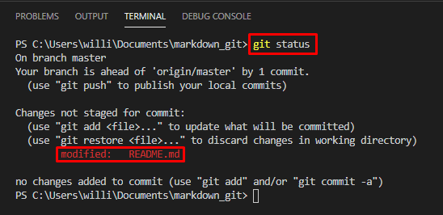

# Git e GitHub
### Controle de versão de código

O GitHub é uma plataforma web que serve como repositório de código, utilizando de recursos do GIT para que possamos centralizar nosso repositório na internet, sendo públicos ou privados. 

### Monitoramento e controle de estágios


* Untracked apesar do arquivo fazer parte do projeto ele ainda não foi adicionado ao monitoramento do git.
* Tracked a partir de então o git passa a controlar as mudanças nesse arquivo, conhecido como **New file**.
* Staged neste ponto o arquivo está preparado para ser enviado ao repositório através de um commit.
* Committed é o processo de salvar as mudanças do projeto até o atual momento.
* Modified é quando ocorre uma modificação sobre um arquivo que está sendo rastreado.

### Comandos básicos

```sh
git init
```
* Inicializa o repositório .git.

```sh
git config user.name "Nome do usúario"
```
* Define o nome do usúario.

```sh
git config user.email "Email do usúario"
```
* Define o e-mail do usúario.

```sh
git status
```



* Verfica  o status do repositório.

```sh
git add "Nome do arquivo"
git add .
```
* Adiciona o arquivo ou todos os arquivos ao repositório.

```sh
git commit -m "Informação sobre o que foi realizado"
```
* Salva as mudanças que ocorreram até o momento e as identifica através de uma mensagem.

# Comandos Intermediários

```sh
git log
git log --oneline
```

* Histórico de comitts

```sh
git checkout 
```

* Navegação por versões do projeto

```sh
git diff
```

* Compara alterações de arquivos

```sh
git commit --amend -m "Texto para substituir"
```
* Substitui o ultimo commit caso escreveu algo errado

