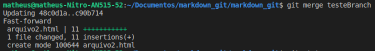
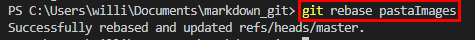
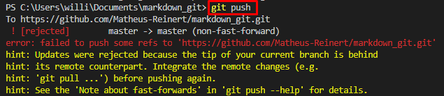
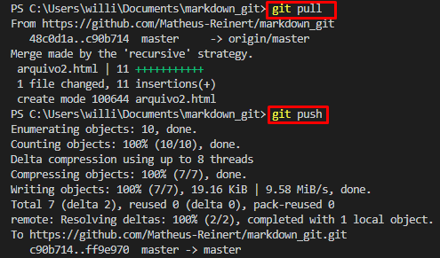

# Git e GitHub
### Controle de versão de código

>O GitHub é uma plataforma web que serve como repositório de código, utilizando de recursos do GIT para que possamos centralizar nosso repositório na internet, sendo públicos ou privados. 

### Monitoramento e controle de estágios


* Untracked apesar do arquivo fazer parte do projeto ele ainda não foi adicionado ao monitoramento do git.
* Tracked a partir de então o git passa a controlar as mudanças nesse arquivo, conhecido como **New file**.
* Staged neste ponto o arquivo está preparado para ser enviado ao repositório através de um commit.
* Committed é o processo de salvar as mudanças do projeto até o atual momento.
* Modified é quando ocorre uma modificação sobre um arquivo que está sendo rastreado.

### Comandos básicos

```sh
git init
```
* Inicializa o repositório .git.
----
```sh
git config user.name "Nome do usúario"
```
* Define o nome do usúario.
----
```sh
git config user.email "Email do usúario"
```
* Define o e-mail do usúario.
----
```sh
git status
```
* Verfica  o status do repositório.


---
```sh
git add "Nome do arquivo"
git add .
```
* Adiciona o arquivo ou todos os arquivos ao repositório.


---

```sh
git commit -m "Informação sobre o que foi realizado"
```
* Salva as mudanças que ocorreram até o momento e as identifica através de uma mensagem.


---

```sh
git push
```
* Atualiza o repositório com o ultimo commit

---
# Comandos Intermediários

```sh
git log
git log --oneline
```

* Histórico de comitts


---

```sh
git checkout 
```

* Navegação por versões do projeto

----


```sh
git diff
```
* Compara alterações de arquivos


---

```sh
git commit --amend -m "Texto para substituir"
```
* Substitui o ultimo commit caso escreveu algo errado

---

# [GitHub Flow](https://guides.github.com/introduction/flow/)

>O fluxo do GitHub é um fluxo de trabalho leve, baseado em branch, que oferece suporte a equipes e projetos onde as implantações são feitas regularmente. 
## Branch

Quando você está trabalhando em um projeto, você terá um monte de recursos ou ideias diferentes em andamento a qualquer momento - alguns dos quais estão prontos para serem executados e outros não. A ramificação existe para ajudá-lo a gerenciar este fluxo de trabalho.

Ao criar um branch em seu projeto, você está criando um ambiente onde pode experimentar novas ideias. As alterações que você faz em um branch não afetam o branch principal, então você está livre para experimentar e enviar alterações, seguro de que seu branch não será fundido até que esteja pronto para ser revisado por alguém com quem você está colaborando .

```sh
git branch testeBranch
git branch
git checkout testeBranch
```


* Branch
    * Cria branch chamada **testeBranch**
    * Visualiza suas branchs criadas
    * Entra na branch criada

Em nosso exemplo utilizamos o nome testeBranch apenas para visualização, em um projeto que está sendo trabalhado em equipe ou até solo, é necessário que possua nomes que remetam ao o que está sendo trabalhado como: **modelo_responsivo**, **implementacao_chaves_de_acesso**.

------
```sh
git branch -D testeBranch2
```


* Excluí  branch testeBranch2

---

# Pull request

>Pull Requests iniciam a discussão sobre seus commits. Como eles estão totalmente integrados ao repositório Git subjacente, qualquer pessoa pode ver exatamente quais alterações seriam mescladas se aceitarem sua solicitação.
Pode ser utilizado quando você está preso e precisa de ajuda ou conselho, ou quando está pronto para alguém revisar seu trabalho. 

# Deploy

>Com o GitHub, você pode implantar a partir de um branch para o teste final na produção antes de mesclar com o principal.
Uma vez que sua solicitação pull foi revisada e o branch passou em seus testes, você pode implantar suas mudanças para verificá-las na produção. Se o seu branch causar problemas, você pode revertê-lo implantando o branch principal existente na produção.
Diferentes equipes podem ter diferentes estratégias de implantação. Para alguns, pode ser melhor implantar em um ambiente de teste especialmente provisionado. Para outros, implantar diretamente na produção pode ser a melhor escolha com base nos outros elementos de seu fluxo de trabalho.


# Merge e Rebase

>Agora que suas alterações foram verificadas na produção, é hora de mesclar seu código no branch principal.
Depois de mescladas, as solicitações pull preservam um registro das alterações históricas em seu código. Por serem pesquisáveis, eles permitem que qualquer pessoa volte no tempo para entender por que e como uma decisão foi tomada.

Para mesclar o projeto temos a opção **merge** e **rebase**, veja os exemplos a seguir e como cada um deles funciona.

-----
### Utilização do Merge

> Uma vez que o Git encontra um commit base em comum, ele cria uma "confirmação de mesclagem" combinando as alterações de cada sequência de commit de mesclagem enfileirada.
Vamos supor que temos um novo recurso de testeBranch que é baseado na branch master. Agora, a gente quer mesclar este recurso no branch master, então alteramos para a branch principal e utilizamos do respectivo comando.

```sh
git merge testeBranch
```


----
### Utilização do Rebase

> O rebase basicamente remonta a base, no merge as alterações entram junto com o andamento do projeto, o rebase retira temporáriamente os commits que vieram depois da criação da branch, só assim inserindo as alterações, após esse processo retorna os commits.

```sh
git rebase pastaImages
```


----
### Erro ao fazer push após a junção

> Ao fazer o push um erro é apresentado na tela, o que faremos agora ?



Nesse caso um pouco antes do colaborador 1 fazer o push do seu projeto com o diretório novo, o colaborador 2 havia feito uma atualização do projeto com um novo arquivo. No momento do push o diretório da máquina do colaborador 1 estava desatualizado em relação ao diretório remoto. Com isso era necessário apenas atualizar o diretótio com um git pull.




