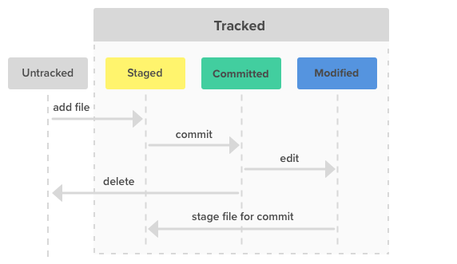

# Git e GitHub
### Controle de versão de código

O GitHub é uma plataforma web que serve como repositório de código, utilizando de recursos do GIT para que possamos centralizar nosso repositório na internet, sendo públicos ou privados. 

### Monitoramento e controle de estágios

